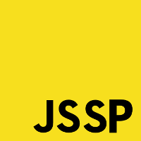

======

* [Apresentação do Meetup](https://speakerdeck.com/raphaelfabeni/bem-vindos-ao-meetp-css)
* [Meetups já realizados](meetups.md)

_"De todos para todos!"_

A ideia do Meetup de Javascript surgiu para aprender coisas novas, conhecer novos profissionais e fortalecer a comunidade.

A ideia do Meetup de Javascript surgiu para aprender coisas novas, conhecer novos profissionais e fortalecer a comunidade. É organizado atualmente por mim ([Daniel Castro](https://twitter.com/dancasttro)) e pelo [Pedro Araújo](https://twitter.com/pedrotcaraujo).
O objetivo do repositório é reunir as principais informações, como links, fotos e palestras sobre os meetups.

* [Meetups](meetups.md)
* [Locais](#locais)
* [Como participo?](#como-participo)
* [Quero apresentar algo!](#quero-apresentar-algo)

## Locais

Se você estiver disposto a nos ajudar com locais para os _meetups_ fique a vontade. :v: Não existe um padrão definido, mas acreditamos que para o _meetup_ ficar bacana, o local precisa:

* Ter suporte para pelo menos dez pessoas.
* Caso o _meetup_  esteja programado com palestras, ter suporte para isso, como um projetor e se for preciso microfone.

Animou? Envie um e-mail pra gente _javascriptsp@gmail.com_.

### E o coffee?

Não é obrigatório. Algumas empresas que cedem o espaço geralmente oferecem, mas não é padrão. Se o local oferecer, ótimo; senão, os organizadores e a pessoa que sugeriu o local podem organizar algo mais simples ou até mesmo, por meio de um aviso prévio, pedir uma ajuda simbólica para os partipantes do _meetup_ para ajudar nos custos. No entanto, o que gostamos de deixar claro é que o *coffee* tem que ser algo secundário em relação ao encontro e não ser a coisa principal.

## Como participo?

Se cadastre no site do [Meetup](http://www.meetup.com/) e se inscreva no [Meetup Javascript São Paulo](http://www.meetup.com/Javascript-SP/). Lá estaremos divulgando as informações referentes aos próximos _meetups_.

## Quero apresentar algo!

Tem vontade de apresentar uma talk sobre algum assunto de Javascript? Ou tem algum bug que não consegue resolver e quer pedir uma força pra galera? Ou simplesmente viu algum link legal e quer divulgar pro pessoal discutir? Maravilha. [Envie algumas informações pra gente através desse link](https://docs.google.com/forms/d/1_j2fitONporJP-VzYJhBgdeQP56cg2gSLejvF0dw8yg/viewform) e assim que tivermos o próximo _meetup_ confirmado, iremos entrar em contato pra verificar sua disponibilidade na data do evento.

## Dúvidas?

Tem alguma dúvida sobre o meetup? Confirmações, listas, faltas. [Saiba mais aqui](conduta.md).
